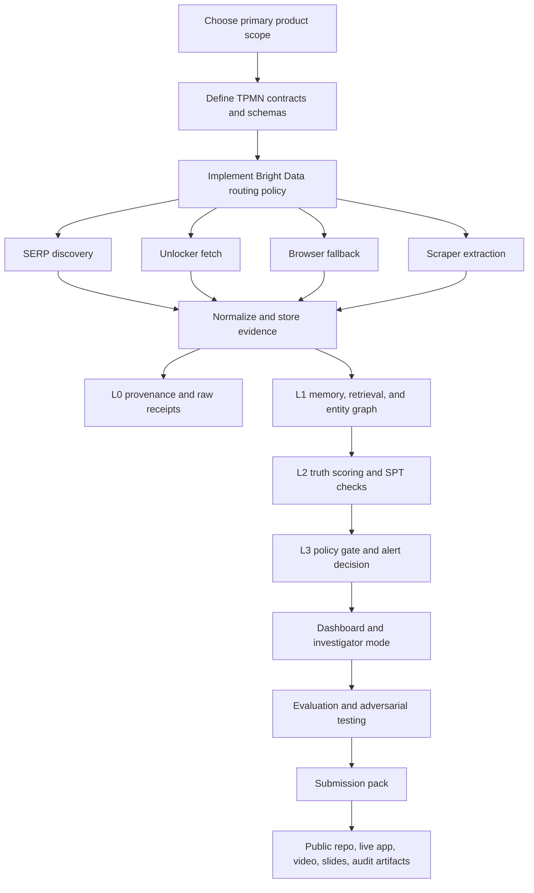

# Winning Strategy for Bright Data Track 3 with GEM² Audit Layers

## Executive summary

Track 3 is explicitly about **Security & Compliance**: the official event page says the target is systems that monitor the **open web** for threats, regulatory changes, third-party risk, and brand exposure; deliver **structured, actionable intelligence**; and let AI agents investigate and alert with live web access rather than stale internal data. The same page also says Bright Data integration is mandatory, projects may span multiple tracks, and judging is based on **Application of Technology, Presentation, Business Value, and Originality**. The published prize is a **$5,000 grand prize** across all tracks, plus potential fast-track access to the Bright Data AI Startup Program with up to **$20,000 in credits**, subject to Bright Data’s standard program criteria and lablab’s general prize terms. citeturn33view0turn33view3turn34view0turn24view0

The best way to win is **not** to build a generic “security chatbot.” The strongest submission is a **watchlist-driven risk operations product** that turns open-web changes into auditable alert objects: a new vendor advisory, a regulator update, a brand exposure signal, or a reputational threat, each backed by clickable evidence and a visible audit trail. That product posture matches Track 3’s wording far better than a broad assistant, and it makes it easier to demonstrate business value and presentation clarity to judges. citeturn33view0turn33view3

My recommendation is to build **OpenRisk Ledger** as the primary MVP: a **third-party risk + regulatory intelligence** system with a one-click **investigator mode**. That gives you the most complete fit to the published Track 3 examples, while also letting you optionally claim overlap with Track 2 around supplier/vendor risk and structured intelligence objects. In practical terms, it should combine **SERP API for discovery**, **Web Unlocker for retrieval**, **Browser API for JS-heavy or interactive pages**, and **MCP Server for live agent investigation**. If account access allows, **Web Archive** is an unusually strong add-on for replay mode, historical diffs, and evaluation. citeturn33view0turn33view1turn22view2turn22view3turn22view5turn22view1turn32view0

GEM² is your differentiation layer. Public GEM² materials describe a stack built from **TPMN-PSL** for formal specifications, **TPMN Checker** for epistemic verification, and **GEM²-AI Platform** for orchestrating multiple agents under explicit contracts. Public repo docs also publish a practical implementation layering of **L0** local scaffold, **L1** Studio/KG workflow capability, and **L2** epistemic verification. I therefore recommend using **L0–L2 exactly as documented**, and treating **L3** as a project-level governance/orchestration layer aligned with GEM²’s documented multi-agent platform and verified handoff model. That gives you a clean, defensible “L0 raw evidence → L1 memory/KG → L2 truth scoring → L3 release governance” story. citeturn36view0turn36view1turn14view1turn14view2turn37view0turn37view1

One important source-quality note: the public hackathon page contains a block of text about **X402 Payments** immediately after the Bright Data Track 3 description. Because that material is inconsistent with the rest of the event page, Bright Data tooling, and Track 3 scope, I exclude it from the strategy below and rely on the Bright Data-consistent sections of the event page plus Bright Data’s official docs. citeturn33view0turn34view0

## Official hackathon brief

The table below condenses the official event page, Bright Data docs, Bright Data trust/compliance pages, and lablab submission guidance. These are the primary sources I used throughout this report. citeturn33view0turn33view1turn33view3turn34view0turn22view0turn22view1turn22view2turn22view3turn23view1turn25view0turn25view1turn25view2turn19view1turn3view1

| Topic | Official reading | Strategic implication |
|---|---|---|
| Track 3 objective | Track 3 is “Security & Compliance,” focused on open-web **threats, regulatory changes, third-party risks, and brand exposure**, with systems that continuously monitor the web, deliver structured intelligence, and let agents investigate and alert autonomously. citeturn33view0 | Build an **operational alerting workflow**, not a generic chat interface. |
| Track 3 examples | The page explicitly names **threat intelligence pipelines**, **regulatory monitoring systems**, **third-party risk tools**, **brand/data exposure monitors**, **AI agents that investigate threat indicators**, and **compliance systems parsing regulatory updates**. citeturn33view0 | Your product should clearly land in one or two of these categories. |
| Core rules | A single submission can span multiple tracks, but **Bright Data tool integration is required** and must be demonstrable. citeturn1view0turn33view3 | Use **at least two Bright Data products** so the sponsor value is obvious. |
| Officially listed tools for Track 3 | The Track 3 line lists **Web Unlocker, Scraping Browser, SERP API, MCP Server, and Web Scraper API**. The overall Technology & Resources section additionally lists **Scraper Studio** and **Proxies** as available to participants. citeturn33view0turn33view1 | Treat **SERP + Unlocker + Browser + MCP** as the default winning stack; add **Scraper API** where platform-specific structured extraction gives you an edge. |
| Bright Data tool capabilities | Official docs describe: **MCP Server** for live web access with hosted endpoints and a free tier; **Rapid** and **Pro** modes with 60+ tools; **Web Unlocker** for anti-bot/CAPTCHA handling; **Browser API** for managed Playwright/Puppeteer/Selenium-style browser automation; **SERP API** for structured search; **Scrapers** for structured JSON from 660+ prebuilt scrapers. citeturn22view0turn22view1turn22view2turn22view3turn22view5turn23view0turn23view1 | Separate **scheduled ingestion** from **interactive investigation**: direct APIs for deterministic jobs, MCP for the live researcher. |
| Technology access | The event page says every participant receives **$250 in Bright Data API credits**, and teams can request more via Discord. Bright Data’s MCP docs separately advertise a **5,000-request/month free tier**. citeturn33view1turn22view0turn26view0 | Use direct APIs for heavy workflows and MCP for live demo research. |
| Judging criteria | Judges score **Application of Technology**, **Presentation**, **Business Value**, and **Originality**. citeturn33view3 | Your winning story must show sponsor tech depth, buyer value, and a crisp demo narrative. |
| Prize and startup path | The page advertises a **$5,000 grand prize**, plus potential fast-track admission to Bright Data’s **AI Startup Program** with up to **$20,000 in credits**. The startup page says the program is for **AI-native startups**, especially funded pre-seed to Series A companies up to $20M, while bootstrapped startups may be eligible for a limited amount. citeturn34view0turn24view0 | Position your project like a real **AI-native product**, not a one-off hack. |
| Eligibility and constraints | The event page says participation is voluntary; prizes depend on eligibility and sponsor availability; rules may change or be canceled; submissions must be **original and MIT-compliant**; distribution may take up to 90 days. Lablab guidance says hackathons are free, all members register independently, teams are required even for solo entries, and staff teams are excluded from judging. citeturn34view0turn19view1turn21search0 | Keep the repo licensing clean and the submission operationally complete. |
| Submission deliverables | The event page requires a **project title, short description, long description, technology/category tags, cover image, video presentation, slide presentation, public GitHub repo, demo platform, and application URL**. The lablab guide says a complete submission needs a **working prototype online**, a **video presentation**, and a **pitch deck**; the current tutorial also describes title and summary length limits and a video target under five minutes. citeturn33view2turn33view3turn19view1turn3view1 | Treat the **submission pack** as part of the product. |
| Compute and model constraints | In the published event page and submission guidance I did **not** find a required language, framework, model vendor, or compute environment. GEM² itself is documented as **BYO-Compute** and supports **Claude, OpenAI, and Gemini** via MCP-compatible workflows. citeturn33view1turn33view3turn36view0 | Use a **model-router abstraction** and choose models for roles, not for the whole system. |

A good strategic reading of the official materials is this: the judges want something that feels like a **real enterprise workflow** and clearly benefits from Bright Data’s web-access stack. The page’s own language about “source coverage and bypass capability” strongly suggests that a winning demo should include at least one source that is **not** trivial static HTML—something JS-heavy, partially blocked, or otherwise difficult enough that Bright Data’s infrastructure is visibly necessary. citeturn33view0turn22view2turn22view3

## GEM² audit architecture

Public GEM² materials describe three things that matter here. First, **TPMN-PSL** is an open mathematical contract language for AI operation and audit, with contracts of the form `F := ⟨A, B, P⟩` and a three-phase protocol: **P-phase**, **Inline**, and **O-phase**. Second, **TPMN Checker** classifies claims as **grounded, inferred, extrapolated, unknown, or speculative**, and checks for **SPT** errors such as **state→trait**, **local→global**, and **thin-evidence→broad-claim**. Third, **GEM²-AI Platform** orchestrates multiple agents under formal reasoning contracts, and TPMN-PSL v0.5.2 formalizes contract-to-contract handoffs through a **Composition Bridge** `G_ij` with a `ValidHandoff` predicate. citeturn37view0turn36view1turn36view0turn37view1

On the implementation side, the public **TPMN Skill Standard** repo explicitly defines **L0**, **L1**, and **L2**: **L0** is local git plus `.gem-squared/` files; **L1** adds semantic search, session recovery, a knowledge graph, and a web UI; **L2** adds truth scoring and multi-provider verification. The repo also shows the project scaffold you can use directly in a hackathon submission, including `.gem-squared/work-plan`, `.gem-squared/verify-work-logs`, `.gem-squared/truth-logs`, `.gem-squared/archive`, and `.gem-squared/reference`. citeturn14view1turn14view2turn28view0turn39view0

Because the public docs do **not** publish a single “L3 audit layer” page in the same implementation taxonomy, the cleanest rigorous move is to define **L3** as a **project-specific governance/orchestration layer** that is consistent with GEM²’s documented platform role and verified multi-agent handoff model. In other words: **L0 raw evidence**, **L1 memory and retrieval**, **L2 epistemic scoring**, and **L3 governed release of decisions and alerts**. That is faithful to the public materials without pretending that all four layers are already published in one place. citeturn14view1turn14view2turn36view0turn37view1

The practical mapping I recommend is below.

| Layer | Official anchor | Runtime checkpoint | Responsibilities | Core artifacts |
|---|---|---|---|---|
| L0 | TPMN Skill: local git + `.gem-squared/` scaffold; always works with no extra dependency. citeturn14view1turn39view0 | **Discovery, fetch, parse** | Define contracts for queries and schemas; store raw pages, URLs, timestamps, fetch method, content hashes, parser outputs, failure receipts, and work-plan state. | `source_manifest.json`, `fetch_receipts.jsonl`, `parse_records.jsonl`, `.gem-squared/work-plan/`, `.gem-squared/verify-work-logs/` |
| L1 | GEM² Studio adds semantic search, session recovery, KG, cross-project learning; `gem2-lfs` is a SQLite-backed local store. citeturn14view1turn14view4turn27view0 | **Memory and retrieval** | Entity resolution, deduplication, prior-case retrieval, session continuity, semantic search over prior alerts and evidence bundles. | `entity_graph`, `case_memory`, `source_index`, `evidence_bundle_store` |
| L2 | GEM² Epistemic Studio / TPMN Checker for truth scoring; EEF + SPT + three-phase verification. citeturn14view2turn36view0turn36view1turn37view0 | **Synthesis and verification** | Claim tagging; truth scoring; contradiction checks; overclaim detection; grounded replacement generation; SPT guards against exaggeration. | `.gem-squared/truth-logs/`, `claim_graph.json`, `verification_reports/` |
| L3 | GEM²-AI Platform orchestrates agents under explicit contracts; TPMN-PSL formalizes `ValidHandoff`. citeturn36view0turn37view1 | **Decision and release** | Severity gating, cross-agent handoff validation, notification policy, human-at-the-edge approvals for high-stakes outputs, immutable audit bundle export. | `decision_packet.json`, `alert_gate_log.jsonl`, `handoff_contracts/`, `customer_facing_alerts/` |

A simple checkpoint policy makes this architecture concrete. If a claim has **no raw source receipt**, it fails at **L0**. If it cannot be linked to the correct entity or prior context, it fails at **L1**. If it has no epistemic label or violates an SPT rule, it fails at **L2**. If it lacks a valid handoff or policy clearance to notify a user, it fails at **L3**. That is the cleanest way to convert GEM² from an abstract audit concept into a visible product architecture. citeturn36view1turn37view1turn14view1

The most valuable part of GEM² for Track 3 is the **SPT guardrail against overclaiming**. In security and compliance tooling, the common bad inference patterns are exactly the ones GEM² names: one outage becomes “this vendor is unreliable” (**state→trait**), a local incident becomes “global compromise” (**local→global**), and a single weak rumor becomes a sweeping risk claim (**thin-evidence→broad-claim**). If you show those checks in the UI, originality and presentation both improve. citeturn36view0turn36view1

## MVP options and implementation plans

Across all four MVPs, the most robust Bright Data routing rule is this: use **SERP API** for discovery, route to **Web Scraper API** when a supported structured extractor exists, use **Web Unlocker** when direct page retrieval is enough, escalate to **Browser API** for JS-heavy or interactive pages, and reserve **MCP Server** for live investigation and analyst-facing agent workflows. That pattern is grounded in the official Bright Data docs and is substantially cleaner than forcing all monitoring traffic through a single chat-style agent loop. If your account access covers it, **Web Archive** is the best replay/backtesting layer in this stack. citeturn22view1turn22view2turn22view3turn22view5turn23view0turn23view1turn32view0

Published materials impose no model-vendor lock-in, and GEM² is documented as **BYO-Compute**. I therefore recommend a role-based model pattern for every MVP: one **high-accuracy reasoning model** for synthesis and verification, one **cheaper classifier/extractor** for triage and structured labeling, and optional embeddings if semantic retrieval is useful. Keep the model interface abstract behind a router so the product does not depend on one provider. citeturn36view0turn33view1

Bright Data also documents MCP integrations for **LangChain/LangGraph** and **CrewAI**, so you can choose either a graph-style orchestrator or a crew-style multi-agent runtime without custom tool plumbing. Bright Data separately documents direct browser support for **Playwright**, **Puppeteer**, and **Selenium** through the Browser API. citeturn38view0turn38view1turn22view3

The comparative assessment below is my recommendation, not an official ranking.

| MVP | Primary user | Bright Data depth | GEM² fit | Complexity | Risk | Demo strength | Recommendation |
|---|---|---:|---:|---:|---:|---:|---|
| **OpenRisk Ledger** | Security, procurement, compliance | High | Very high | Medium-high | Medium | Very high | **Best overall winner candidate** |
| **RegDelta Copilot** | Compliance operations, legal ops | Medium-high | Very high | Medium | Low-medium | High | **Best precision/clarity candidate** |
| **Brand & Exposure Sentinel** | Security, corp comms, brand protection | High | High | Medium-high | High | High | **Most original, highest false-positive risk** |
| **Threat Investigator** | Security analyst, executive risk owner | High | Very high | Medium | Medium | **Highest live-demo wow factor** | **Best secondary mode to embed into MVP one** |

**MVP one — OpenRisk Ledger**  
This is the build I would choose if the goal is to maximize score across all four judging criteria. It sits squarely inside Track 3’s official wording around **third-party risk**, **regulatory changes**, and **actionable structured intelligence**, while also letting you optionally frame part of the product as Track 2-adjacent supplier/vendor intelligence. It also makes sponsor technology highly visible because the pipeline naturally uses discovery, bypassing, rendering, extraction, and agentic investigation together. citeturn33view0turn33view3turn22view2turn22view3turn23view1turn22view1

| Component | Recommended build |
|---|---|
| Bright Data ingestion | SERP API for vendor/regulator discovery; Web Unlocker for trust centers, advisories, and policy pages; Browser API for JS-heavy status pages; Web Scraper API for supported sources such as LinkedIn or social platforms where public structured extraction is useful; optional Web Archive for history and replay |
| Agent runtime | LangGraph or CrewAI with five roles: `discoverer`, `fetcher`, `normalizer`, `risk_scorer`, `reporter` |
| Retrieval and models | PostgreSQL + pgvector or `gem2-lfs` for local builds; one high-accuracy reasoning model, one low-cost classifier |
| Prompt contract | TPMN schemas for `RiskEvent`, `VendorEntity`, `EvidenceBundle`, `ActionMemo`, `DecisionPacket` |
| Audit hooks | L0 raw receipts and hashes; L1 entity graph and prior-case retrieval; L2 truth scoring and SPT checks; L3 notification gate and `ValidHandoff` between scoring and publishing |
| Storage | Postgres, object store such as MinIO/S3, optional Neo4j for graph view |
| UI and demo | Next.js or React dashboard with watchlist, risk cards, source panel, and one-click “Investigate” button |
| Open-source libraries/APIs | FastAPI, Pydantic, SQLAlchemy/SQLModel, LangGraph or CrewAI, LiteLLM, Playwright, pgvector |

**Implementation steps**  
1. Define the canonical schemas first: `SourceDocument`, `VendorEntity`, `RiskEvent`, `Claim`, `EvidenceLink`, `DecisionPacket`.  
2. Build a query-template engine for vendors, regulators, and brands; emit search jobs through SERP API with source-tiering rules.  
3. Implement fetch routing: `supported structured source -> Scraper API`, `static page -> Unlocker`, `rendered/interactive page -> Browser API`.  
4. Normalize content into a source graph and event graph; deduplicate by `(entity, event_type, time_window, source_hash)`.  
5. Run L2 verification on the analyst-visible summary only; every final claim must have an evidence pointer and an epistemic label.  
6. Run L3 gating before publishing alerts: high-severity claims require stronger corroboration than low-severity observations.

**Code structure outline**
```text
apps/
  api/
  web/
workers/
  discover/
  fetch/
  normalize/
  score/
  publish/
packages/
  schemas/
  brightdata/
  gem2_audit/
  retrieval/
storage/
  migrations/
  seeds/
eval/
  gold/
  replay/
docs/
  architecture/
  judge-guide/
```

**Key algorithms**  
Use **entity resolution** that combines domain normalization, legal-name aliases, and semantic similarity; use **change detection** on content hash plus semantic diff so cosmetic boilerplate changes do not flood the system; and use a **severity-aware corroboration policy** where higher-severity alerts demand stronger or more primary evidence. The scoring function should be interpretable, not opaque: source tier, contradiction status, source freshness, and claim groundedness should all be visible in the UI.

**Testing and evaluation plan**  
Build a gold set from a watchlist of real vendors and seeded incidents using official sources such as **CISA’s Known Exploited Vulnerabilities Catalog** and the **NVD CVE API**, plus manually labeled vendor trust/advisory/status pages. Score the system on **alert precision**, **event extraction recall**, **duplicate-collapse rate**, **grounded-claim ratio**, and **unsupported-claim rate**. Your adversarial suite should include syndicated news duplicates, stale mirrors, prompt-injection text inside scraped pages, vendor boilerplate changes, and contradictions between first-party notices and press coverage. citeturn31search0turn31search1turn32view0

**MVP two — RegDelta Copilot**  
This is the cleanest compliance-focused build. It maps directly to the track’s official examples around **regulatory monitoring** and **compliance systems parsing updates and alerting teams when action is required**. It is less flashy than vendor-risk monitoring, but it is often more precise and easier to defend in front of judges because the sources are tier-one by design. citeturn33view0

| Component | Recommended build |
|---|---|
| Bright Data ingestion | SERP API for source discovery and localization; Unlocker for regulator pages and circulars; Browser API for JS-heavy regulation portals; Web Archive for before/after snapshots |
| Agent runtime | Deterministic diff pipeline with an LLM only for obligation extraction and control mapping |
| Retrieval and models | Mostly rule-based section parsing plus a reasoning model for impact summaries |
| Prompt contract | `RegulatoryDelta`, `Obligation`, `AffectedControl`, `ActionChecklist`, `ImpactMemo` |
| Audit hooks | L0 source snapshot and section map; L1 versioned regulation memory; L2 claim-state labeling on extracted obligations; L3 approval gate before organization-wide action alerts |
| Storage | Postgres + object storage; no graph DB required unless mapping to many control families |
| UI and demo | Clean redline-style delta viewer with obligations and affected stakeholders |
| Open-source libraries/APIs | FastAPI, Pydantic, trafilatura/selectolax, difflib or semantic diff library, Postgres |

**Implementation steps**  
1. Curate high-value regulators first and force the system onto official domains.  
2. Store pages as versioned snapshots and section trees rather than plain text blobs.  
3. Compute structural diffs before any LLM call.  
4. Ask the model only to classify change significance, extract obligations, and map them to a policy/control taxonomy.  
5. Route all final obligation summaries through L2 verification.  
6. Generate action checklists with reviewer-ready citations and section anchors.

**Code structure outline**
```text
apps/
  api/
  compliance_web/
workers/
  discover_regs/
  snapshot/
  diff/
  obligation_extract/
packages/
  parse/
  contracts/
  gem2_audit/
storage/
  versions/
eval/
  delta_gold/
  replay/
```

**Key algorithms**  
The important algorithms are **versioned page diffing**, **section-aware obligation extraction**, and **policy/control mapping**. This MVP wins when you minimize hallucination risk by using LLMs only after deterministic diffing has reduced the problem space.

**Testing and evaluation plan**  
Seed the system with official pages from **EUR-Lex**, the **SEC** cybersecurity disclosure rules materials, and selected **CISA** regulatory or guidance pages. Measure **delta-detection precision**, **section-link accuracy**, **obligation extraction F1**, **checklist completeness**, and **grounded-claim ratio**. Adversarial tests should include cosmetic template changes, amended or repealed texts, multilingual pages, annex-heavy documents, and outdated search results pointing to superseded versions. citeturn31search2turn31search3turn31search0turn32view0

**MVP three — Brand and Exposure Sentinel**  
This is the most original Track 3 build, but it also carries the most false-positive and compliance risk. The safe version is a **public-only, passive monitor** for impersonation pages, reputational threats, suspicious public mentions, and exposed documents or configuration indicators that are already publicly reachable. It should never attempt login, exploit verification, credential use, or access to nonpublic sources. That constraint is not optional: Bright Data’s Acceptable Use Policy forbids collection of **nonpublic information** and other abusive behaviors, and Bright Data’s ethics docs emphasize public-only collection, minimization, logging, and governance. citeturn25view1turn25view2turn25view0

| Component | Recommended build |
|---|---|
| Bright Data ingestion | SERP API with brand, domain, filetype, and scam-query templates; Unlocker for landing pages and leaked-document references that are already public; Browser API for JS-heavy impersonation sites; Scraper APIs for public social signals where useful |
| Agent runtime | CrewAI-style triage crew: `query_planner`, `investigator`, `severity_classifier`, `report_writer` |
| Retrieval and models | Lexical retrieval first; optional embeddings for name-variant clustering |
| Prompt contract | `ExposureFinding`, `BrandThreat`, `EvidenceBundle`, `RemediationNote` |
| Audit hooks | L0 public-only source receipt; L1 dedupe and alias graph; L2 severity verification and overclaim checks; L3 human-at-the-edge for outbound escalation |
| Storage | Postgres + queue + object store |
| UI and demo | Triage board showing severity lanes and a clear public-evidence panel |
| Open-source libraries/APIs | FastAPI, CrewAI, Redis, SQLAlchemy, Playwright, pnpm/Next.js or Streamlit |

**Implementation steps**  
1. Put a strict source policy in code: public only, no logins, no active probing, no exploit validation.  
2. Build brand/domain alias packs and query templates.  
3. Normalize findings into exposure types such as `impersonation`, `public_doc_exposure`, `reputation_signal`, or `suspicious_brand_reference`.  
4. Add severity rules before any LLM-based summary generation.  
5. Route all medium/high-severity reports through L2 and L3 before they appear as “action required.”

**Code structure outline**
```text
apps/
  api/
  triage_web/
workers/
  brand_query/
  fetch_public_pages/
  classify_exposure/
  escalate/
packages/
  public_source_policy/
  gem2_audit/
  severity_rules/
eval/
  false_positive_set/
  seeded_exposure_cases/
```

**Key algorithms**  
Use **query expansion** for brand aliases, **near-duplicate clustering** for scam and impersonation pages, and **severity heuristics** that make source tier and corroboration visible. A finding should be able to say, in plain English, whether it is **confirmed**, **likely**, **weakly supported**, or **unknown**—which is exactly where GEM²’s claim-state labeling helps.

**Testing and evaluation plan**  
Use a manually curated set of public positive and negative examples. Measure **precision at each severity threshold**, **false-positive rate**, **reviewer agreement**, **grounded-claim ratio**, and **time-to-triage clicks** in the UI if you want a UX metric. Adversarial cases should include SEO spam, parody/satire, typo domains, news articles that mention a leak without proving one, and injected page text instructing the model to ignore prior rules.

**MVP four — Threat Investigator**  
This is the best **live demo mode**, and you should strongly consider embedding it inside MVP one even if you do not submit it as the primary standalone concept. The user enters a company, vendor, topic, or indicator; the system uses Bright Data live web tools to gather evidence, then produces an evidence-backed memo, contradiction summary, and claim-state trace. This fits the track’s wording on **AI agents that investigate threat indicators and return structured risk assessments autonomously** almost verbatim. citeturn33view0

| Component | Recommended build |
|---|---|
| Bright Data ingestion | MCP Server for live search/scrape/browser actions; SERP API and Unlocker for deterministic backend fetches; Browser API fallback for hard pages |
| Agent runtime | Research graph or multi-agent loop with roles such as `planner`, `researcher`, `skeptic`, `synthesizer` |
| Retrieval and models | On-the-fly web retrieval + local cache of evidence bundles |
| Prompt contract | `InvestigationRequest`, `ClaimSet`, `Counterevidence`, `RiskAssessment`, `ExecutiveMemo` |
| Audit hooks | L0 raw tool receipts; L1 investigation memory; L2 claim-state and contradiction analysis; L3 publish gate for “recommended action” |
| Storage | Evidence cache + report store |
| UI and demo | Chat panel + source inspector + claim-state side panel |
| Open-source libraries/APIs | LangGraph or Google ADK, `langchain-mcp-adapters`, FastAPI, Postgres, NetworkX or graph visualization library |

**Implementation steps**  
1. Start with a fixed investigation schema, not free-form chat.  
2. Separate search planning from evidence synthesis.  
3. Force the researcher to collect both confirming and contradicting evidence.  
4. Require the synthesizer to output claims as grounded, inferred, or unknown.  
5. Refuse final “action required” conclusions when corroboration is too thin.

**Code structure outline**
```text
apps/
  api/
  investigator_web/
agents/
  planner/
  researcher/
  skeptic/
  synthesizer/
packages/
  mcp_client/
  gem2_audit/
  report_builder/
eval/
  investigation_benchmark/
  contradiction_cases/
```

**Key algorithms**  
Use **query planning**, **source triangulation**, **contradiction detection**, and **confidence calibration**. The most important trick is not model sophistication; it is the discipline of collecting disagreeing evidence before synthesis.

**Testing and evaluation plan**  
Benchmark the system on a set of investigation prompts built from the **CISA KEV catalog**, **NVD**, and official advisories or regulatory pages. Measure **evidence coverage**, **contradiction-detection rate**, **unsupported-claim rate**, and **human usefulness score** on the final memo. Adversarial tests should include conflicting sources, rumor-heavy blog posts, JS-only target pages, low-credibility sources outranking first-party sources, and prompt injection inside scraped content. citeturn31search0turn31search1turn22view1turn22view3

The highest-ceiling submission is therefore a **hybrid**: submit **OpenRisk Ledger** as the primary product and embed **Threat Investigator** as the live, high-wow analysis surface. That gives you continuous monitoring for business value and a compelling demo for presentation and originality. citeturn33view0turn33view3

## Security, compliance, demo, and judging strategy

Track 3 is a security/compliance challenge, so a winning build should visibly respect privacy, legality, and evidence quality. Bright Data’s public trust and policy materials emphasize **publicly available data only**, privacy-law compliance, and an ethical collection framework built around five principles: **collect public data only**, **collect only what you need**, **protect the web**, **keep detailed logs**, and **enforce governance and reporting**. GEM²’s own materials align well with that approach through claim-state labeling, SPT overclaim checks, and “human at the edge” rather than human-in-the-loop micromanagement. citeturn25view0turn25view1turn25view2turn25view3turn36view1turn37view0

The cleanest layer-by-layer mapping is below.

| Layer | Security, privacy, compliance, and ethics controls |
|---|---|
| **L0** | Enforce **public-only source policy** in code; block login-required collection; capture URL, timestamp, fetch path, and hash for every source; store parser failures as first-class artifacts; implement robots/AUP review notes in the source manifest. |
| **L1** | Use allowlists, deny lists, source-tier metadata, retention rules, and encryption at rest; keep entity memory and evidence references queryable; deduplicate aggressively so you do not needlessly re-hit the web. |
| **L2** | Run prompt-injection checks on page text; require claim-state labels; flag SPT violations; suppress unsupported recommendations; scrub or mask unnecessary personal data from analyst-visible summaries. |
| **L3** | Gate alerts and outbound notifications by severity and corroboration policy; require a human-at-the-edge checkpoint for high-stakes actions; export immutable audit bundles for judges and customers. |

A particularly strong principle for Track 3 is **severity-tiered corroboration**. Low-severity watchlist signals can rely on one source. Medium-severity alerts should require a primary source plus one corroborating source. High-severity “action required” events should require either a first-party source or an official regulator/advisory plus corroboration. That policy directly operationalizes GEM²’s **thin-evidence→broad-claim** prohibition and is easy to explain in a demo. citeturn36view0turn36view1

The demo should make Bright Data and GEM² **visible**, not hidden. Judges should be able to see a nontrivial web source being discovered, successfully fetched or rendered, transformed into a structured event, and then audited claim by claim. The product will feel much more original if the UI exposes **why** the system trusts or distrusts a finding. citeturn33view0turn33view3turn22view2turn22view3turn36view0

The strongest demo scenarios are these:

| Demo scenario | What happens | What the judge sees | Why it scores well |
|---|---|---|---|
| **Vendor risk event** | A watchlist item surfaces a new vendor advisory or trust-center change. | Search results, fetched source, structured risk card, and a GEM² side panel showing grounded vs inferred claims. | Strong **business value** and **application of technology**. |
| **Regulatory delta** | The system detects a changed regulator page and turns it into obligations. | Before/after source view, extracted obligations, affected teams, and evidence links. | Strong **clarity** and **presentation**. |
| **Investigator mode** | You click “Investigate” on an alert and the agent runs a live evidence-gathering loop. | Bright Data-powered live web actions followed by a structured, auditable memo. | Strong **originality** and “wow” factor. |

A clean slide/storyboard that fits lablab’s required submission format is below.

| Slide | Purpose |
|---|---|
| **Problem** | Open-web risk signals live outside SIEMs and internal systems. |
| **User** | Procurement/security/compliance analyst blocked by manual web research. |
| **Why now** | Live web signals matter because threats, guidance, and exposure move faster than internal systems. |
| **Solution** | Your product turns live web evidence into structured, audited risk objects. |
| **Sponsor tech** | Show the Bright Data routing stack: discovery, unlock/render, structured extraction, investigator mode. |
| **Audit differentiator** | Explain GEM² L0–L3 and show one alert with its evidence and claim-state trace. |
| **Business value** | Show what action the user can take immediately and why this belongs in a real team workflow. |
| **Product path** | Explain how this becomes a repeatable AI-native startup opportunity, which also aligns with Bright Data’s startup-program framing. |

The judging-focused success criteria should be explicit inside the product and the deck.

| Judging criterion | What to emphasize | Concrete proof in the submission |
|---|---|---|
| **Application of Technology** | Multiple Bright Data products used for clearly different roles. | Screenshot or logs proving discovery, fetch, render, and agent investigation. |
| **Presentation** | One narrative, one user, one workflow. | Live app with one-click path from alert to evidence to action memo. |
| **Business Value** | An enterprise team could actually use this. | Watchlists, action-oriented alerts, and a user role with a real buying center. |
| **Originality** | AI does not just scrape and summarize; it **self-audits**. | Visible GEM² truth panel, SPT checks, and audit bundle export. |

## Deliverables, repository, and roadmap

The event page and lablab guidance define the must-have package. A polished Track 3 submission should go beyond those minimum fields and make the audit story easy to inspect. citeturn33view2turn33view3turn19view1turn3view1

| Artifact | Officially required | Strongly recommended to win |
|---|---|---|
| Public GitHub repository | Yes. citeturn33view2 | Include `README`, architecture, evaluation, legal/compliance notes, and a judge guide. |
| Live application URL | Yes. citeturn33view2turn19view1 | Add a replay mode or seeded scenarios so the UI is stable even if live sources shift. |
| Video presentation | Yes. lablab’s current tutorial describes a short video target, under five minutes. citeturn33view2turn3view1 | Show one complete workflow: discovery → evidence → audit → action. |
| Slide presentation / pitch deck | Yes. citeturn33view2turn19view1 | Mirror the storyboard above and keep every slide evidence-oriented. |
| Title, summary, long description, tags | Yes. citeturn33view2turn3view1 | Use the copy to make Track 3 fit unmistakable. |
| Bright Data proof | Required in substance because Bright Data use must be demonstrable. citeturn33view3 | Add `docs/BRIGHTDATA_INTEGRATION.md` with each product used, why, and where in the code. |
| Audit proof | Not explicitly required | Add `artifacts/audit-bundles/`, `.gem-squared/truth-logs/`, and sample verification reports. |
| Evaluation proof | Not explicitly required | Add `eval/results.md` and a small gold set or replay cases. |
| Legal/compliance note | Not explicitly required | Add `LEGAL.md` describing public-only scope, AUP compliance, and privacy minimization. |

A repo structure that fits both the submission requirements and the public TPMN scaffold looks like this:

```text
.
├─ apps/
│  ├─ api/
│  └─ web/
├─ workers/
│  ├─ discover/
│  ├─ fetch/
│  ├─ normalize/
│  ├─ verify/
│  └─ publish/
├─ packages/
│  ├─ schemas/
│  ├─ brightdata/
│  ├─ gem2_audit/
│  ├─ retrieval/
│  └─ ui_components/
├─ eval/
│  ├─ gold/
│  ├─ replay/
│  └─ results.md
├─ artifacts/
│  ├─ audit-bundles/
│  ├─ source-receipts/
│  └─ demo-scenarios/
├─ docs/
│  ├─ judge-guide.md
│  ├─ architecture.md
│  ├─ BRIGHTDATA_INTEGRATION.md
│  ├─ LEGAL.md
│  └─ THIRD_PARTY_NOTICES.md
├─ .gem-squared/
│  ├─ alarm.md
│  ├─ work-plan/
│  ├─ verify-work-logs/
│  ├─ truth-logs/
│  ├─ archive/
│  ├─ reference/
│  ├─ external-skills/
│  └─ gem2-core-skills/
├─ .claude/
│  └─ skills/
├─ CLAUDE.md
├─ README.md
├─ LICENSE
└─ docker-compose.yml
```

One subtle but important constraint is licensing. The hackathon page says submissions must be **MIT-compliant**. The public TPMN Skill repo says its **code and skills** are MIT, but its **specification documents** are **CC-BY-4.0**; the standalone TPMN-PSL repo is also **CC-BY-4.0**. The correct strategy is therefore to keep **your own code repo under MIT**, keep any copied TPMN-PSL text or spec excerpts in attributed files, and include a `THIRD_PARTY_NOTICES.md` or equivalent notice rather than pretending every included artifact is MIT. This is one of the easiest places a serious submission can accidentally get sloppy; treat it carefully. citeturn34view0turn39view0turn37view1

For development and judge reproducibility, GEM²’s public tooling can help directly. The `tpmn-skill` repo already provides the `.gem-squared/` scaffold and lifecycle logs, `gem2-lfs` is a SQLite-backed local knowledge store, and `gem2-setup` can auto-register the TPMN Checker MCP server across several coding tools while backing up config and avoiding server-side key storage. That is useful if you want judges or teammates to reproduce the audit environment without bespoke setup notes. citeturn39view0turn27view0turn13view0

The roadmap below is deliberately **timeline-agnostic**. It reflects the official submission requirements, Bright Data’s documented product stack, and GEM²’s contract-and-verification workflow. citeturn33view2turn33view3turn22view1turn22view2turn22view3turn36view0turn39view0



If you want the single clearest “win plan,” it is this: submit **OpenRisk Ledger** as a **real third-party risk and regulatory intelligence product**, embed a **Threat Investigator** mode for the live demo, and make the **GEM² audit trail impossible to miss**. That combination is the strongest fit to the official Track 3 wording, the published judging criteria, Bright Data’s best-documented strengths, and GEM²’s verification story. citeturn33view0turn33view3turn22view1turn22view2turn22view3turn36view0turn37view1